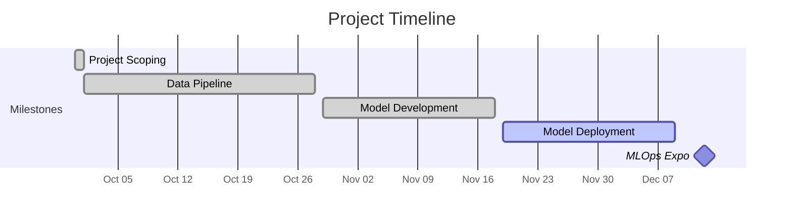

# Optimizing Bluebikes Operations with Machine Learning Based Demand Prediction

## About

### Overview
This project applies predictive analytics to Boston's Bluebikes bike-sharing system to address supply-demand mismatches that cause revenue loss and customer dissatisfaction when stations are empty or full.

Bluebikes serves 4.7 million annual rides but faces persistent challenges with bike availability at stations. Current mitigation relies on the "Bike Angels" user incentive program, which cannot adequately respond to dynamic demand from weather changes, events, or peak hours.

Bluebikes generates rich spatiotemporal datasets capturing cycling patterns, station utilization, and user behavior. By leveraging this data through predictive modeling, we can anticipate demand and proactively optimize bike distribution.

### Goals
- Reduce revenue loss from unavailable bikes.
- Improve user satisfaction by ensuring bike availability.
- Enable proactive operations instead of reactive responses.
- Support city-wide sustainability and traffic reduction initiatives.

### Approach
Develop predictive models using historical ridership patterns, weather data, seasonal variations, and event-driven demand spikes to forecast when and where bikes will be needed most.

## Folder Structure
```
Optimizing-Bluebikes-Operations-with-Machine-Learning-Based-Demand-Prediction/
│── README.md                  # Project description and setup
│── requirements.txt           # Python dependencies
│── config/                    # Config files for data sources, models, API
│── data_pipeline/            # Data collection, processing, and orchestration
│   └── README.md             # Detailed data pipeline documentation
│── notebooks/                # Jupyter notebooks for EDA and prototyping
│── Model/                    # Machine learning models
├── Deployment/               # Deployment configurations
│── tests/                    # Unit and integration tests
│── docs/                     # Diagrams, data cards, scoping document
```

## Installation/Replication 

The following steps will ensure that anyone can set up and reproduce the Bluebikes pipeline - either locally or using the full Dockerized Airflow environment.

### Prerequisites


| Tool | Minimum Version | Purpose |
|------|------------------|----------|
| [Python](https://www.python.org/downloads/) | 3.11 | Local execution and development |
| [Docker](https://docs.docker.com/get-docker/) | 24.0+ | Containerization |
| [Docker Compose](https://docs.docker.com/compose/install/) | 2.20+ | Orchestration for Airflow stack |
| [Git](https://git-scm.com/downloads) | any | Repository cloning |

### Clone the repository
```bash
git clone https://github.com/PranavViswanathan/Optimizing-Bluebikes-Operations-with-Machine-Learning-Based-Demand-Prediction.git
cd Optimizing-Bluebikes-Operations-with-Machine-Learning-Based-Demand-Prediction
```

### Local Setup (Without Docker)

python -m venv venv
source venv/bin/activate #macOS/Linux
venv\Scripts\activate

pip install --upgrade pip
pip install -r requirements.txt

Run the pipeline:

python data_pipeline/scripts/datapipeline.py

Logs and data output are stored in: 
data_pipeline/logs/
data_pipeline/data/

### To run orchestration stack (Airflow + Postgres + Redis)

bash start-airflow.sh

This will:
 - Build the Airflow containers
 - Initialize the Airflow database
 - Create and admin user (airflow2/ airflow2)
 - Launch the UI at http://localhost:8080

 bash stop-airflow.sh

 This will: 
- Stop Airflow and cleanup

### To run Standalone Pipeline Container

To run only the data pipeline:

docker build -f Dockerfile.pipeline -t ml-pipeline .
docker run --rm -v $(pwd)/data_pipeline/data:/app/data ml-pipeline


## Data Pipeline

The project includes a comprehensive data pipeline for collecting, processing, and transforming Bluebikes ridership data, Boston college locations, and NOAA weather data. The pipeline is orchestrated using Apache Airflow and runs in a containerized Docker environment.

**[View Detailed Data Pipeline Documentation](./data_pipeline/README.md)**

Key features:
- Automated data collection from multiple sources (Bluebikes, Boston GIS, NOAA)
- Data validation, cleaning, and preprocessing
- Airflow DAG orchestration with scheduled runs
- Discord alert notifications for pipeline monitoring
- Dockerized deployment for reproducibility

## Preliminary Project Timeline


## Status
This repository is in the **Model Deployment phase**.  
Code, data pipelines, and models will be added in upcoming sprints.
