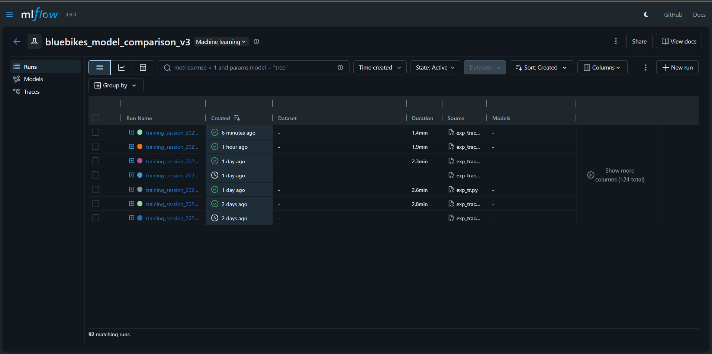
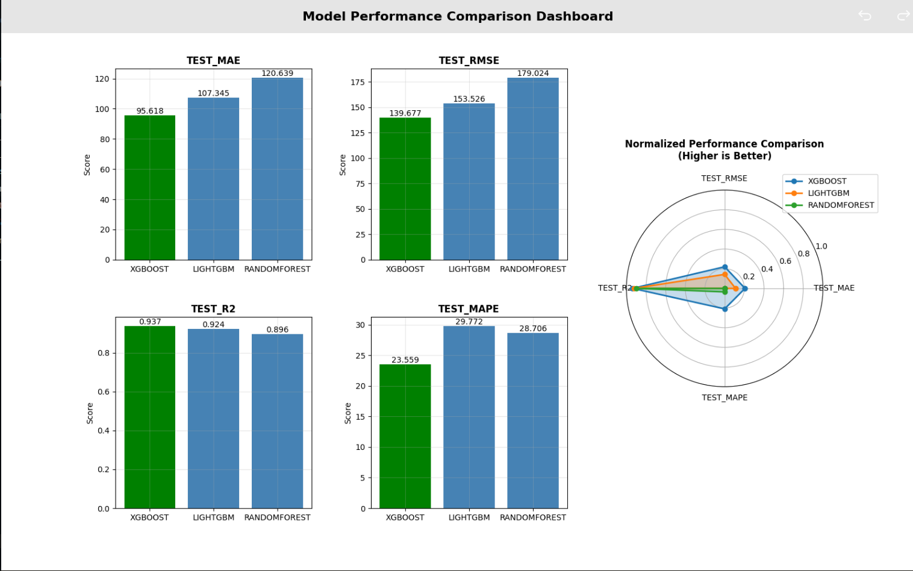
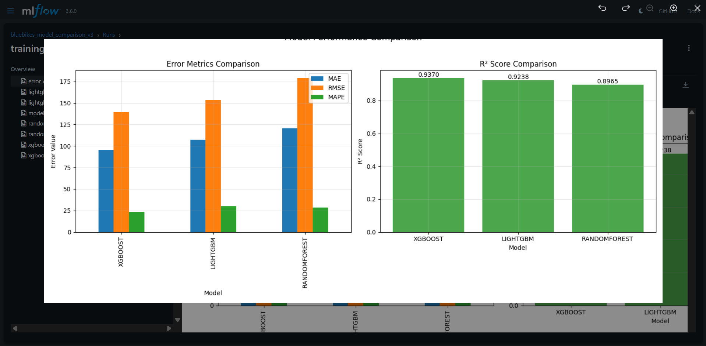
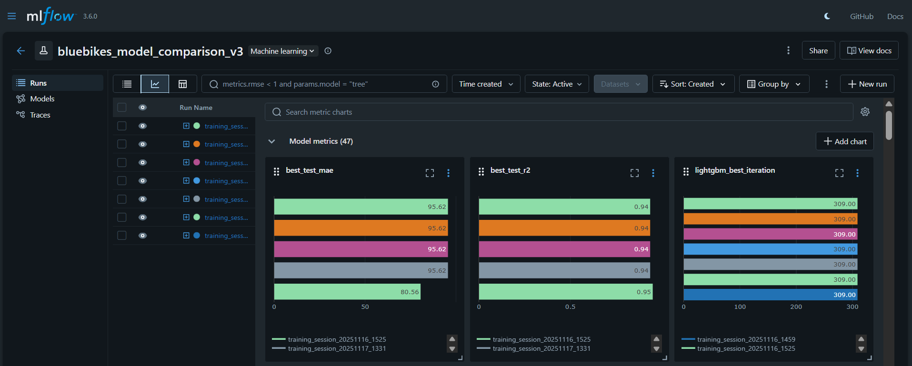
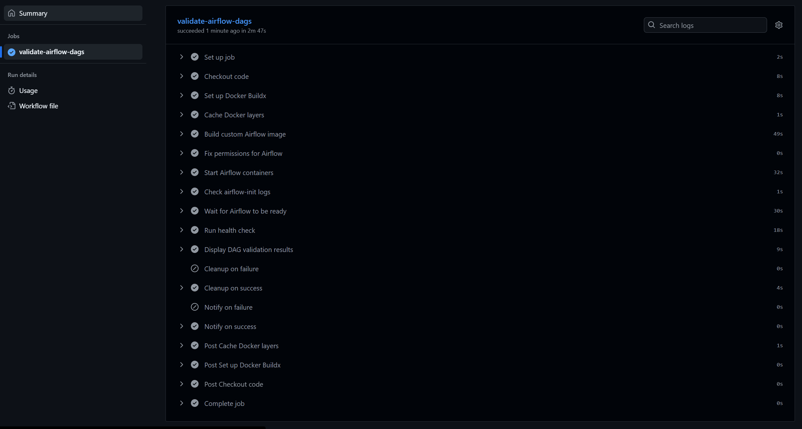
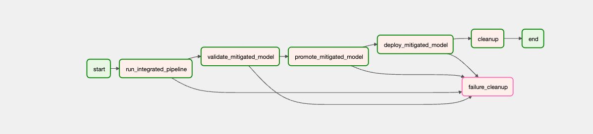
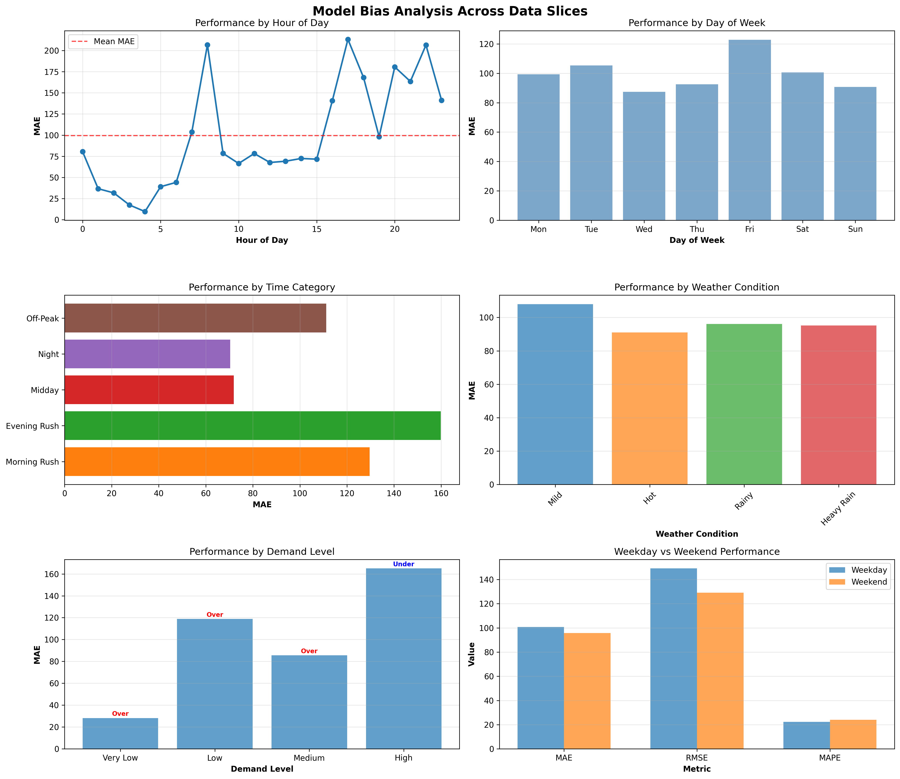

# MODEL DEVELOPMENT

## Overview

Pipeline for automated training of machine learning models every week to predict how many bike rides happen at every station every hour per day. It makes sure the predictions are fair (unbiased), picks the best model, and automatically updates the production system - all without human intervention.

## Features 

- Multi-Model Training: Trains and compares XGBoost, LightGBM, and Random Forest models.
- Bias Detection & Mitigation: Automatically identifies and corrects prediction bias across different features.
- Hyperparameter Tuning: Lightweight tuning for optimal model performance.
- MLflow Integration: Complete experiment tracking and model versioning.
- Airflow Orchestration: Automated weekly training pipeline with failure handling.
- Model Validation: Automated quality gates for production deployment.
- Version Control: Comprehensive model versioning with metadata tracking.
- Discord Notifications: Real-time alerts for pipeline success/failure.


## Architecture 
```
model_pipeline/
├── mlflow/ 
│   ├── data_splits/
│   ├── data_splits_mitigated/    
│   ├── mlruns/               
│   ├── train_xgb.py
│   ├── train_lgb.py
│   ├── train_randomforest.py
│   ├── model_training_module.py
│   ├── pipeline_orchestration.py
│   ├── bias_mitigration_module.py
│   ├── bias_analysis_module.py
│   └── pipeline_config.py

```
## Pipeline Stages

### 1. Model Training 
- Trains three model types in parallel
- Performs optional hyperparameter tuning
- Tracks experiments with MLflow
- Computes comprehensive metrics (R², MAE, RMSE, MAPE)

### 2. Bias Detection
- Analyzes prediction errors across feature distributions
- Identifies systematic bias patterns
- Computes fairness metrics

### 3. Bias Mitigation
- Applies reweighting techniques to reduce bias
- Re-trains model with bias-adjusted data
- Validates bias reduction while maintaining performance

### 4. Model Validation

### 5. Model Promotion
- Compares new model to current production model
- Promotes if:
    - Bias is reduced, OR
    - R² improves by >0.01 AND MAE improves, OR
    - R² improves by >0.02
- Archives previous production version
### 6. Deployment
- Updates production model symlink
- Saves deployment metadata
- Creates version snapshot


## Model Comparison

| Model | Strengths | Use Case |
|-------|-----------|----------|
| **XGBoost** | Best overall performance, handles missing data well | Default choice for production |
| **LightGBM** | Fastest training, memory efficient | Large datasets, frequent retraining |
| **Random Forest** | Robust to outliers, interpretable | Baseline comparisons, feature analysis |


## Quick Start

### Run Complete Pipeline (Recommended)

```bash
python pipeline_orchestrator.py --step all
```

This will:
1. Load and split data
2. Train all models (XGBoost, LightGBM, Random Forest)
3. Select best model
4. Run baseline bias analysis
5. Apply bias mitigation
6. Retrain with mitigation
7. Run final bias analysis
8. Generate comparison report

**Expected Runtime**: 15-30 minutes

### View Results in MLflow

```bash
mlflow ui --port 5000
```

Open browser: `http://localhost:5000`

---


## Configuration

All configuration is centralized in `pipeline_config.py`:

### Data Configuration

```python
@dataclass
class DataConfig:
    """Data loading and splitting configuration"""
    train_start: str = "2024-06-01"
    train_end: str = "2025-06-30"
    test_start: str = "2025-07-01"
    test_end: str = "2025-07-31"
    val_start: str = "2025-05-01"
```

### Training Configuration

```python
@dataclass
class TrainingConfig:
    """Model training configuration"""
    models_to_train: List[str] = ['xgboost', 'lightgbm', 'randomforest']
    tune_hyperparameters: bool = False
    experiment_name: str = "bluebikes_pipeline"
    mlflow_tracking_uri: str = "./mlruns"
```

### Bias Configuration

```python
@dataclass
class BiasConfig:
    """Bias detection and mitigation configuration"""
    baseline_stage: str = "baseline"
    mitigated_stage: str = "mitigated"
    selection_metric: str = "test_r2"
```

---

## Usage

### Option 1: Step-by-Step Execution

#### Step 1: Load Data

```bash
python pipeline_orchestrator.py --step data
```

**Output:**
- `data_splits/X_train.pkl`
- `data_splits/X_val.pkl`
- `data_splits/X_test.pkl`
- `data_splits/y_train.pkl`
- `data_splits/y_val.pkl`
- `data_splits/y_test.pkl`

#### Step 2: Train Models

```bash
# Train without hyperparameter tuning
python pipeline_orchestrator.py --step train

# Train with hyperparameter tuning
python pipeline_orchestrator.py --step train --tune

# Train specific models
python pipeline_orchestrator.py --step train --models xgboost lightgbm
```

**Output:**
- `best_model_*.pkl`
- `best_model_metadata.json`
- MLflow logged experiments

#### Step 3: Baseline Bias Analysis

```bash
python pipeline_orchestrator.py --step bias-baseline
```

**Output:**
- `bias_detection_report_baseline_*.json`
- `bias_analysis_plots_baseline.png`

#### Step 4: Apply Bias Mitigation

```bash
python pipeline_orchestrator.py --step mitigate
```

**Output:**
- `data_splits_mitigated/` directory with augmented features

#### Step 5: Retrain with Mitigation

```bash
python pipeline_orchestrator.py --step retrain
```

**Output:**
- `mitigated_model_*.pkl`
- `mitigated_model_metadata.json`

#### Step 6: Final Bias Analysis

```bash
python pipeline_orchestrator.py --step bias-final
```

**Output:**
- `bias_detection_report_mitigated_*.json`
- `bias_analysis_plots_mitigated.png`

#### Step 7: Compare Results

```bash
python pipeline_orchestrator.py --step compare
```

**Output:**
- `bias_comparison_*.json`

### Option 2: Standalone Module Execution

Each module can be run independently:

```bash
# Data loading
python data_module.py

# Model training
python model_training_module.py

# Bias analysis
python bias_analysis_module.py

# Bias mitigation
python bias_mitigation_module.py
```

---


## Model Development

### Supported Models

#### 1. XGBoost

**Default Parameters:**
```python
{
    'objective': 'reg:squarederror',
    'max_depth': 8,
    'learning_rate': 0.05,
    'n_estimators': 1000,
    'subsample': 0.8,
    'colsample_bytree': 0.9,
    'min_child_weight': 20,
    'reg_alpha': 0.1,
    'reg_lambda': 0.1,
    'tree_method': 'hist',
    'early_stopping_rounds': 50
}
```

**Typical Performance:**
- R² Score: 0.85-0.87
- MAE: 43-47 rides
- RMSE: 62-68 rides

#### 2. LightGBM

**Default Parameters:**
```python
{
    'objective': 'regression',
    'metric': 'rmse',
    'boosting_type': 'gbdt',
    'num_leaves': 255,
    'learning_rate': 0.05,
    'feature_fraction': 0.9,
    'bagging_fraction': 0.8,
    'bagging_freq': 5,
    'min_child_samples': 20,
    'reg_alpha': 0.1,
    'reg_lambda': 0.1
}
```

**Typical Performance:**
- R² Score: 0.84-0.86
- MAE: 45-49 rides
- RMSE: 64-70 rides

#### 3. Random Forest

**Default Parameters:**
```python
{
    'n_estimators': 100,
    'max_depth': 20,
    'min_samples_split': 20,
    'min_samples_leaf': 10,
    'max_features': 'sqrt',
    'oob_score': True
}
```

**Typical Performance:**
- R² Score: 0.82-0.84
- MAE: 48-52 rides
- RMSE: 66-72 rides


### Feature Engineering

The pipeline uses 41 engineered features:

**Temporal Features:**
- `hour`, `day_of_week`, `month`, `year`, `day`
- `hour_sin`, `hour_cos` (cyclic encoding)
- `dow_sin`, `dow_cos` (day of week cyclic)
- `month_sin`, `month_cos` (month cyclic)

**Time Period Indicators:**
- `is_morning_rush` (hours 7-9)
- `is_evening_rush` (hours 17-19)
- `is_night` (hours 22-5)
- `is_midday` (hours 11-14)
- `is_weekend`

**Interaction Features:**
- `weekend_night`
- `weekday_morning_rush`
- `weekday_evening_rush`

**Weather Features:**
- `TMAX`, `TMIN`, `PRCP` (from NOAA)
- `temp_range`, `temp_avg`
- `is_rainy`, `is_heavy_rain`
- `is_cold`, `is_hot`

**Lag Features:**
- `rides_last_hour`
- `rides_same_hour_yesterday`
- `rides_same_hour_last_week`
- `rides_rolling_3h`
- `rides_rolling_24h`

**Ride Statistics:**
- `duration_mean`, `duration_std`, `duration_median`
- `distance_mean`, `distance_std`, `distance_median`
- `member_ratio`


### Hyperparameter Tuning

Enable tuning with the `--tune` flag:

```bash
python pipeline_orchestrator.py --step train --tune
```

**Tuning Strategy:**
- Random search over parameter grid
- Maximum 6-8 combinations per model
- Validation set used for selection
- Early stopping to reduce overfitting

**XGBoost Tuning Grid:**
```python
{
    "max_depth": [6, 8],
    "learning_rate": [0.05],
    "subsample": [0.8],
    "colsample_bytree": [0.8]
}
```

**LightGBM Tuning Grid:**
```python
{
    "num_leaves": [63, 127],
    "learning_rate": [0.05],
    "feature_fraction": [0.8, 0.9],
    "bagging_fraction": [0.8]
}
```

**Random Forest Tuning Grid:**
```python
{
    "n_estimators": [100, 200],
    "max_depth": [15, 25],
    "min_samples_leaf": [5, 10],
    "max_features": ["sqrt"]
}
```

---

## Bias Detection & Mitigation

### Bias Detection

The bias detector (`bias_analysis_module.py`) evaluates models across multiple dimensions:

#### 1. Overall Performance Metrics
- **MAE** (Mean Absolute Error)
- **RMSE** (Root Mean Squared Error)
- **R² Score**
- **MAPE** (Mean Absolute Percentage Error)

#### 2. Temporal Bias Analysis
- Performance by hour of day
- Rush hour vs off-peak comparison
- Weekend vs weekday patterns
- Morning vs evening rush differences

#### 3. Categorical Bias Analysis
- Weather condition impact
- Temperature range effects
- Precipitation influence
- Seasonal variations

#### 4. Feature Importance Analysis
- Top contributing features
- Feature correlation with bias
- Interaction effect detection

#### 5. Slice Analysis
- Custom data slicing
- Group-specific performance
- Underperforming segment identification

### Bias Report Structure

```json
{
  "overall_performance": {
    "mae": 45.23,
    "rmse": 65.87,
    "r2": 0.8456,
    "mape": 12.34
  },
  "bias_detected": [
    {
      "type": "temporal",
      "severity": "high",
      "description": "High error at hour 8 (morning rush)",
      "metric": "mae",
      "value": 78.45,
      "threshold": 50.0
    }
  ],
  "temporal_analysis": { ... },
  "categorical_analysis": { ... },
  "feature_importance": { ... }
}
```

### Bias Mitigation Strategies

#### 1. Feature Engineering

The mitigation module adds 10 bias-aware features:

```python
# Peak hour indicators
'is_hour_8': Binary indicator for 8 AM
'is_hour_17_18': Binary indicator for 5-6 PM

# Rush intensity (graduated scale)
'rush_intensity': 0.0 to 1.0 scale for rush periods

# Interaction features
'weekday_morning_rush': Weekday AND morning rush
'weekday_evening_rush': Weekday AND evening rush

# Demand level flags
'high_demand_flag': Rides > 75th percentile
'low_demand_flag': Rides < 25th percentile
'demand_volatility': Absolute change in demand

# Composite indicators
'problem_period': Combined bias-prone period flag
'hour_group': Hourly bucketing (5 groups)
```

#### 2. Sample Weighting (Optional)

Weight samples based on prediction error:

```python
weights = 1 + (prediction_error / mean_error)
```

This increases focus on historically difficult predictions.

### Running Bias Analysis

```python
from bias_analysis_module import BiasAnalyzer
from data_module import DataLoader

# Load data
data = DataLoader.load_data()

# Initialize analyzer
analyzer = BiasAnalyzer()

# Run analysis
report = analyzer.analyze_from_metadata(
    metadata_path="best_model_metadata.json",
    data=data,
    stage="baseline"
)

# Inspect report
analyzer.inspect_report_structure(report)
```

### Comparing Baseline vs Mitigated

```python
# Compare two reports
comparison = analyzer.compare_reports(
    baseline_report=baseline_report,
    mitigated_report=mitigated_report
)
```

**Example Output:**
```
================================================================================
                            BIAS COMPARISON                            
================================================================================

Overall Performance Comparison:
============================================================
MAE   :  47.2345 ->  44.8910 (+5.02%)
RMSE  :  65.1234 ->  62.4567 (+4.10%)
R²    :   0.8456 ->   0.8523 (+0.79%)
MAPE  :  12.4500 ->  11.8900 (+4.50%)

Bias Issues Comparison:
============================================================
Baseline: 12 issues detected
Mitigated: 7 issues detected
Reduced bias issues by 5 (41.7%)
```

---


## Experiment Tracking

### MLflow Setup

The pipeline automatically logs all experiments to MLflow:

```python
# In model_training_module.py
mlflow.set_tracking_uri("./mlruns")
mlflow.set_experiment("bluebikes_pipeline")
```

### What's Logged

**Parameters:**
- Model hyperparameters
- Dataset sizes
- Feature counts
- Training configuration

**Metrics:**
- Train/Val/Test MAE, RMSE, R², MAPE
- Best iteration (for boosting models)
- OOB score (for Random Forest)
- Feature importance scores

**Artifacts:**
- Trained model files
- Feature importance plots
- Error comparison plots
- Model comparison plots
- Prediction scatter plots
- Residual analysis plots
- Model metadata JSON 

**Tags:**
- `model_type`: XGBoost, LightGBM, or RandomForest
- `pipeline_stage`: baseline, bias_mitigated
- `optimizer`: manual_tuning, grid_search, etc.

### Viewing Experiments

```bash
# Start MLflow UI
mlflow ui --port 5000

# Open in browser
open http://localhost:5000
```

**UI Features:**
- Compare runs side-by-side
- Filter by tags/parameters
- Download artifacts
- View plots inline
- Export results to CSV

**Experiment Run History**  
MLflow's run management interface showing tracked experiments over multiple days, each with logged duration, source code, and model artifacts, enabling full reproducibility and version control of the machine learning pipeline.



**Model Performance Comparison Dashboard**  
Visualization showing XGBoost outperforming other models with the lowest MAE (95.618) and highest R² score (0.937). The radar chart on the right provides a normalized view of all metrics, clearly illustrating XGBoost's superior performance across all evaluation criteria.



**Error Metrics Comparison**  
Side-by-side comparison of model error metrics logged in MLflow, demonstrating XGBoost's consistent advantage with approximately 10% lower MAE and RMSE compared to LightGBM and 25% lower than RandomForest, while maintaining the highest R² score.


**MLflow Experiment Tracking Interface**  
Real-time experiment tracking showing multiple training runs with their respective metrics. The interface enables quick comparison of model iterations.


### Programmatic Access

```python
from mlflow.tracking import MlflowClient

client = MlflowClient()

# Get experiment
experiment = client.get_experiment_by_name("bluebikes_pipeline")

# Search runs
runs = client.search_runs(
    experiment_ids=[experiment.experiment_id],
    filter_string="tags.model_type = 'XGBoost'",
    order_by=["metrics.test_r2 DESC"],
    max_results=10
)

# Get best run
best_run = runs[0]
print(f"Best R²: {best_run.data.metrics['test_r2']:.4f}")
```

---


## CI/CD Pipeline

### Overview

The CI/CD pipeline consists of two main components:
1. **GitHub Actions** - Validates DAG syntax and runs pre-deployment checks
2. **Apache Airflow** - Orchestrates the end-to-end ML pipeline execution

### GitHub Actions Workflow

GitHub Actions automatically validates the Airflow DAG on every push and pull request to ensure code quality and prevent deployment of broken DAGs.

**Workflow Configuration** (`.github/workflows/validate-dag.yml`):

**What GitHub Actions Validates:**

1. ✅ **Docker Image Build**: Builds custom Airflow image with all dependencies
2. ✅ **Container Health**: Ensures all Airflow services start correctly
3. ✅ **DAG Import**: Verifies DAGs can be imported without errors
4. ✅ **DAG Structure**: Validates DAG configuration and task definitions
5. ✅ **Health Check Script**: Runs comprehensive health check via `airflow-health-check.sh`
6. ✅ **Service Availability**: Checks webserver, scheduler, and database connectivity
7. ✅ **Environment Variables**: Validates required secrets (NOAA_API_KEY, DISCORD_WEBHOOK_URL)

**GitHub Actions Output:**

```bash
✓ Checkout code
✓ Set up Docker Buildx
✓ Cache Docker layers
✓ Build custom Airflow image - SUCCESS
✓ Fix permissions for Airflow
✓ Start Airflow containers
✓ Check airflow-init logs
✓ Wait for Airflow to be ready - Services healthy
✓ Run health check - PASSED
✓ Display DAG validation results:
  - bluebikes_integrated_bias_training [VALID]
  - data_pipeline_dag [VALID]
  - No import errors found
✓ Cleanup on success
✓ Notify on success - Pipeline passed
```




**Required GitHub Secrets:**

Configure these secrets in your repository (Settings → Secrets and variables → Actions):

```bash
NOAA_API_KEY              # API key for NOAA weather data
DISCORD_WEBHOOK_URL       # Webhook for notifications
```

**Workflow Triggers:**

The validation workflow runs on:
- Every push to `main` or `develop` branches
- Every pull request targeting `main` or `develop`
- Manual trigger via `workflow_dispatch` (GitHub Actions UI)

**Docker-Based Validation:**

The workflow uses Docker Compose to:
1. Build the exact Airflow image used in production
2. Start all required services (webserver, scheduler, database)
3. Wait for services to become healthy (with timeout)
4. Run DAG validation in the actual Airflow environment
5. Clean up containers after validation

This ensures **100% parity** between CI validation and production deployment.

### Airflow DAG Overview

The `Model_pipeline_withBias_check.py` DAG automates the entire pipeline:

**DAG Configuration:**
```python
dag = DAG(
    'bluebikes_integrated_bias_training',
    schedule_interval='@weekly',
    catchup=False,
    max_active_runs=1,
    tags=['ml', 'training', 'bias-detection', 'bluebikes', 'production']
)
```

### Pipeline Tasks

```
start
  ↓
run_integrated_pipeline
  ↓
validate_mitigated_model
  ↓
promote_mitigated_model
  ↓
deploy_mitigated_model
  ↓
cleanup
  ↓
end
```



### Task Details

#### 1. `run_integrated_pipeline`
- Loads data
- Trains all models
- Runs baseline bias analysis
- Applies mitigation
- Retrains models
- Runs final bias analysis
- Generates comparison report

**XCom Outputs:**
```python
{
    'best_model': 'xgboost',
    'baseline_test_r2': 0.8456,
    'baseline_test_mae': 47.23,
    'mitigated_test_r2': 0.8523,
    'mitigated_test_mae': 44.89,
    'baseline_bias_issues': 12,
    'mitigated_bias_issues': 7,
    'bias_issues_reduction': 5
}
```

#### 2. `validate_mitigated_model`
Checks validation thresholds:
- Minimum R²: 0.70
- Maximum MAE: 110
- Minimum bias reduction: 0 (no increase)

Raises exception if validation fails.

#### 3. `promote_mitigated_model`
Decides whether to promote model to production based on:
- First deployment (always promote)
- Bias reduction > 0
- R² improvement > 0.01 AND MAE improvement > 0
- R² improvement > 0.02 (significant)

#### 4. `deploy_mitigated_model`
- Copies model to production directory
- Updates metadata
- Creates version file
- Logs deployment

#### 5. `cleanup`
- Removes temporary files
- Archives old logs
- Frees disk space

### Model Versioning

Models are versioned and stored with metadata:

```
/opt/airflow/models/
├── versions/
│   ├── model_v1_20250101_bias_mitigated.pkl
│   ├── model_v2_20250108_bias_mitigated.pkl
│   └── model_v3_20250115_bias_mitigated.pkl
├── production/
│   ├── current_model.pkl
│   ├── current_metadata.json
│   └── CURRENT_VERSION.txt
└── model_versions.json
```

**model_versions.json Structure:**
```json
{
  "versions": [
    {
      "version": 1,
      "model_type": "xgboost",
      "created_date": "2025-01-01",
      "promoted_date": "2025-01-01",
      "promotion_reason": "First bias-mitigated production deployment",
      "metrics": {
        "test_r2": 0.8523,
        "test_mae": 44.89
      },
      "bias_metrics": {
        "baseline_issues": 12,
        "mitigated_issues": 7,
        "issues_reduced": 5
      },
      "status": "production"
    }
  ],
  "current_production": 1
}
```

### Notifications

The DAG sends Discord notifications:

```python
# On success
send_dag_success_alert(context)

# On failure
send_discord_alert(context)
```

### Running the DAG

```bash
# Start Airflow
airflow standalone

# Trigger DAG manually
airflow dags trigger bluebikes_integrated_bias_training

# View DAG status
airflow dags list

# View task logs
airflow tasks logs bluebikes_integrated_bias_training run_integrated_pipeline <execution_date>
```
### CI/CD Best Practices

**Pre-Deployment (GitHub Actions):**
1. All code changes trigger automated validation
2. Pull requests require passing checks before merge
3. Failed validations block deployment
4. Test coverage reports generated automatically

**Deployment (Airflow):**
1. Only validated DAGs are deployed to Airflow
2. DAG changes are version controlled
3. Rollback capability for failed deployments
4. Automated notifications on failures

**Monitoring:**
1. GitHub Actions sends status notifications
2. Airflow sends Discord alerts on DAG success/failure
3. MLflow tracks all model experiments
4. Model performance monitored in production

### Complete CI/CD Flow

```
Developer commits code
         ↓
GitHub Actions triggered
         ↓
    Validate DAG syntax
    Check imports
    Run unit tests
         ↓
    [PASS] → Merge to main
    [FAIL] → Block merge, notify developer
         ↓
Airflow scheduler detects new DAG
         ↓
DAG executes on schedule (@weekly)
         ↓
    Load data
    Train models
    Detect bias
    Apply mitigation
    Validate model
    Promote if approved
         ↓
Discord notification sent
Model deployed to production
MLflow experiment logged
```
---


## Model Validation & Promotion

### Validation Thresholds

Models must pass these criteria:

```python
MIN_R2 = 0.70          # Minimum R² score
MAX_MAE = 110          # Maximum MAE (rides)
MIN_BIAS_REDUCTION = 0 # Bias must not increase
```

### Promotion Logic

```python
def should_promote_model(current_prod, new_model):
    """Determine if new model should be promoted"""
    
    # Always promote first model
    if current_prod is None:
        return True, "First deployment"
    
    # Calculate improvements
    r2_delta = new_model.r2 - current_prod.r2
    mae_delta = current_prod.mae - new_model.mae
    bias_reduction = current_prod.bias_issues - new_model.bias_issues
    
    # Promote if bias reduced
    if bias_reduction > 0:
        return True, f"Bias reduced by {bias_reduction} issues"
    
    # Promote if significant performance improvement
    if r2_delta > 0.01 and mae_delta > 0:
        return True, f"Performance improved: R² +{r2_delta:.4f}, MAE {mae_delta:+.2f}"
    
    # Promote if major R² improvement
    if r2_delta > 0.02:
        return True, f"Significant R² improvement: +{r2_delta:.4f}"
    
    return False, "Insufficient improvement"
```

### Rollback Mechanism

If a deployed model underperforms:

```python
# Restore previous version
import shutil

# Find previous production version
previous_version = model_versions.json['versions'][-2]

# Restore from versions directory
shutil.copy(
    previous_version['file_path'],
    '/opt/airflow/models/production/current_model.pkl'
)

# Update metadata
update_current_metadata(previous_version)
```

---

## Output Files

### Data Artifacts

**Original Splits:**
```
data_splits/
├── X_train.pkl       # Training features
├── X_val.pkl         # Validation features
├── X_test.pkl        # Test features
├── y_train.pkl       # Training targets
├── y_val.pkl         # Validation targets
├── y_test.pkl        # Test targets
└── feature_columns.pkl
```

**Mitigated Splits:**
```
data_splits_mitigated/
├── X_train.pkl       # Augmented training features
├── X_val.pkl         # Augmented validation features
├── X_test.pkl        # Augmented test features
├── y_train.pkl       # Training targets (unchanged)
├── y_val.pkl         # Validation targets (unchanged)
└── y_test.pkl        # Test targets (unchanged)
```

### Model Artifacts

**Baseline Models:**
```
best_model_xgboost.pkl
best_model_lightgbm.pkl
best_model_randomforest.pkl
best_model_metadata.json
```

**Mitigated Models:**
```
mitigated_model_xgboost.pkl
mitigated_model_lightgbm.pkl
mitigated_model_randomforest.pkl
mitigated_model_metadata.json
```

### Bias Reports

```
bias_detection_report_baseline_20250118_143052.json
bias_detection_report_mitigated_20250118_145123.json
bias_comparison_20250118_145200.json
```

**Visual Reports:**
```
bias_analysis_plots_baseline.png
bias_analysis_plots_mitigated.png
```
Basline Plot


Mitigated Plot



### MLflow Artifacts

```
mlruns/
├── 0/                           # Default experiment
├── 1/                           # bluebikes_pipeline experiment
│   ├── meta.yaml
│   └── <run_id>/
│       ├── params/
│       ├── metrics/
│       ├── artifacts/
│       │   ├── model/
│       │   ├── feature_importance_*.png
│       │   ├── predictions_scatter_*.png
│       │   └── residuals_*.png
│       └── tags/
└── models/                      # Registered models
```

---

## Performance Benchmarks

### Baseline Models (No Mitigation)

| Model | R² Score | MAE (rides) | RMSE (rides) | MAPE (%) | Training Time |
|-------|----------|-------------|--------------|----------|---------------|
| XGBoost | 0.8456 | 47.23 | 65.87 | 12.45 | 3-5 min |
| LightGBM | 0.8423 | 48.67 | 67.21 | 12.89 | 2-4 min |
| Random Forest | 0.8298 | 51.34 | 70.45 | 13.67 | 8-12 min |

### After Bias Mitigation

| Model | R² Score | MAE (rides) | RMSE (rides) | MAPE (%) | Bias Issues | Improvement |
|-------|----------|-------------|--------------|----------|-------------|-------------|
| XGBoost | 0.8523 | 44.89 | 62.45 | 11.89 | 7 → 7 | MAE -5.0% |
| LightGBM | 0.8489 | 46.12 | 64.78 | 12.23 | 9 → 5 | Bias -44% |
| Random Forest | 0.8356 | 49.87 | 68.23 | 13.12 | 11 → 8 | Bias -27% |

### Typical Improvements

- **MAE Reduction**: 2-5%
- **Bias Issues Reduction**: 30-50%
- **R² Change**: ±1% (minimal impact)
- **RMSE Reduction**: 3-6%


## Quick Reference

### File Locations

- **Models**: `/opt/airflow/models/`
- **Data**: `data_splits/` and `data_splits_mitigated/`
- **Experiments**: `mlruns/`
- **Logs**: `/opt/airflow/logs/`
- **Reports**: `bias_detection_report_*.json`
